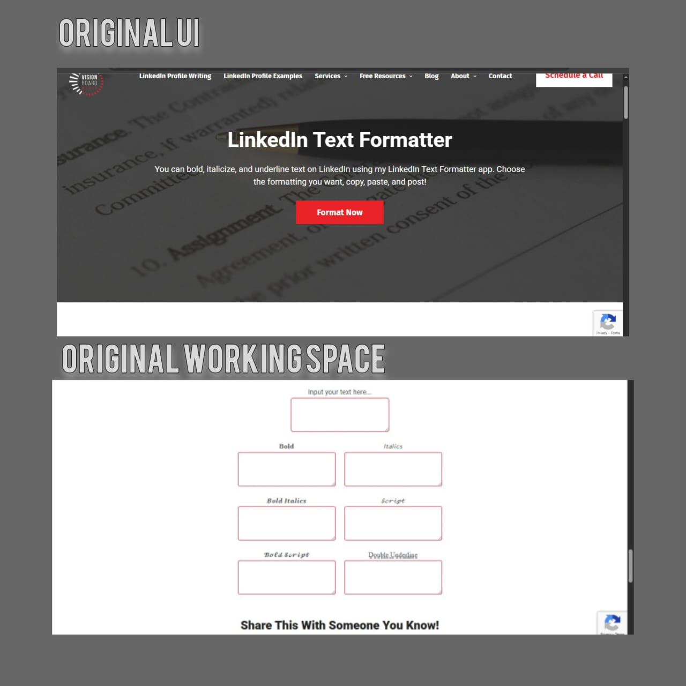
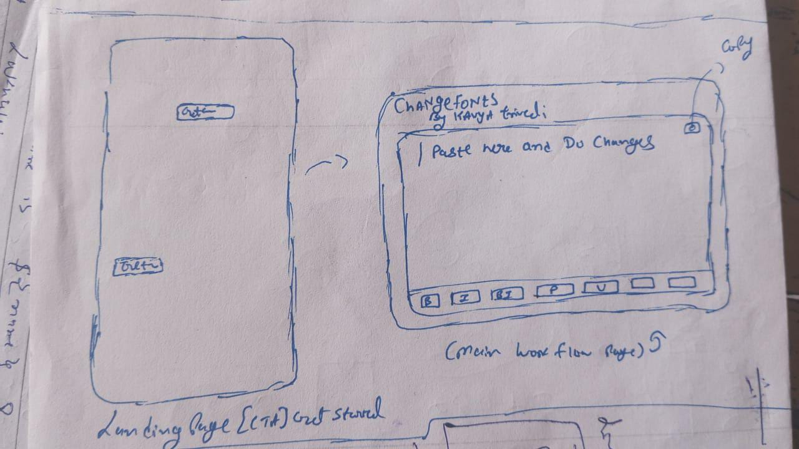
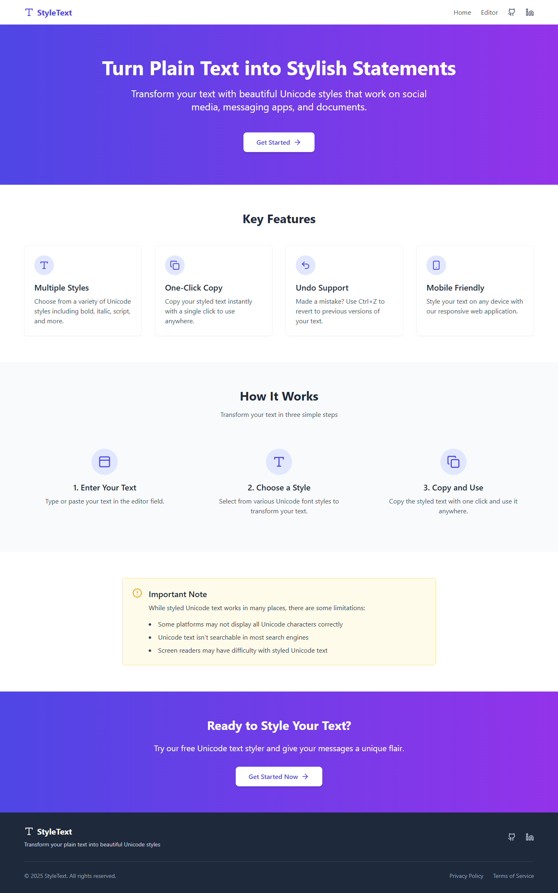
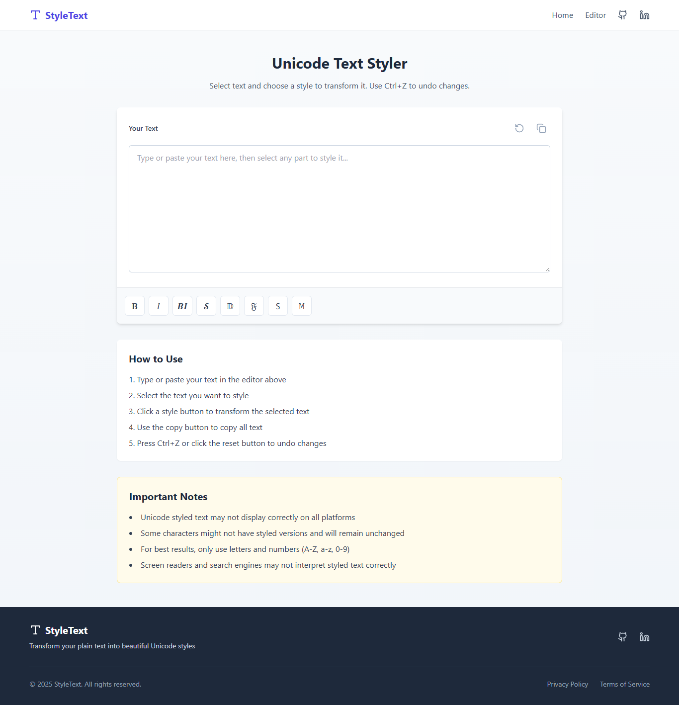

# 🔡 LinkedIn Text Formatter – UI Redesign

## 🛠️ What I Did
I redesigned a web tool that allows users to format LinkedIn text with styles like **bold**, *italic*, and more using Unicode characters.

The original inspiration came from a website called **Style Text**, which offered free resources for LinkedIn formatting—but had a poor user experience. I took the core idea and rebuilt it with a focus on simplicity and usability.

---

## ❌ Problems with the Original Site
- ❌ Confusing UI
- ❌ Difficult to navigate
- ❌ Complicated text selection and copying
- ❌ Poor overall usability for a simple task
- Here is the original UI
- 

---

## ✅ What I Improved
- ✅ Clean and user-friendly interface
- ✅ Added a **"Get Started"** button to guide users
- ✅ **Selective text styling** – instead of converting the whole input to one style, users can now apply bold, italic, or other styles **to specific words or parts of the text**
- ✅ Simplified text copying process
- ✅ Ensured styled text appears exactly the same on LinkedIn
- ✅ Improved overall performance and functionality
- Here is my sketch
- 
- & here is my Original UI
- 
- 

---

## 🎯 Main Goal / Purpose
Originally, I built this for myself to solve a real frustration when formatting LinkedIn posts.

Eventually, I decided to **broaden the purpose** by:
- Enhancing the free resources available on similar sites
- Making the platform more accessible to others
- Creating a tool that’s easier to use for everyone

---

---

## 🔗 Live Demo / Preview
[Visit the live tool here](#) *(https://textformatter-freeresourcepagebykavya.netlify.app/)*

---

## 💬 Feedback
Open to feedback and suggestions!  
Feel free to open an issue or connect on [LinkedIn](https://linkedin.com/in/your-profile).

---

## 📌 Tags
`#UIRedesign` `#LinkedInTool` `#FrontendProject` `#UXDesign` `#ProblemSolving` `#SideProject`

