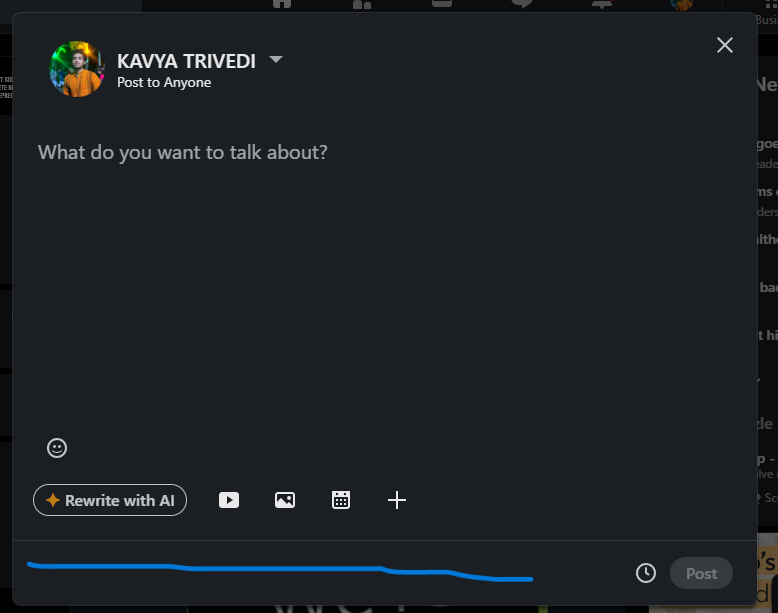
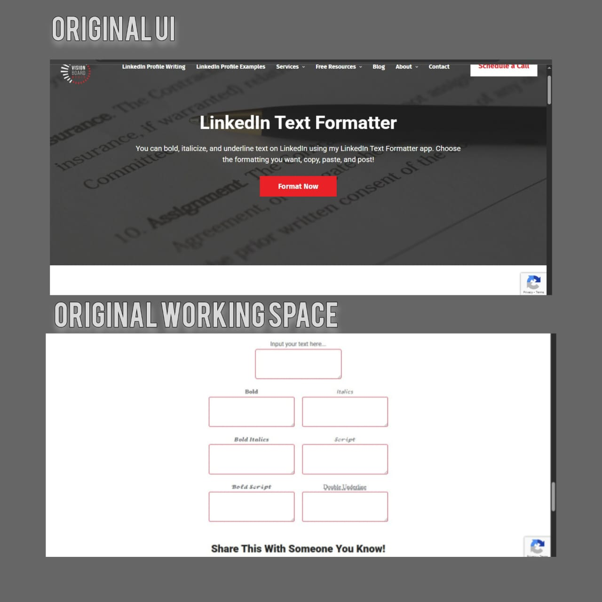
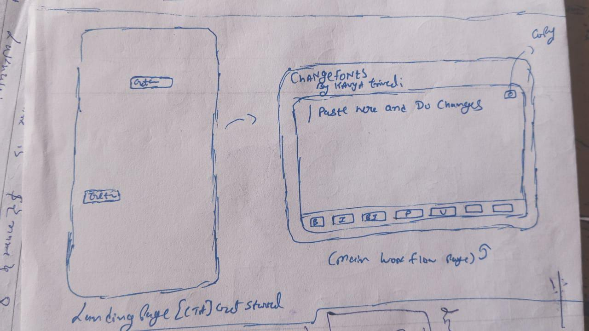
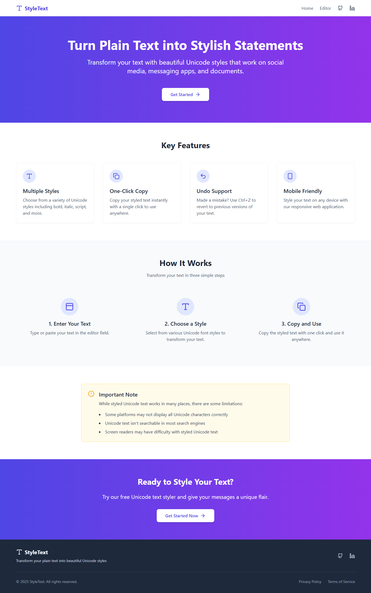
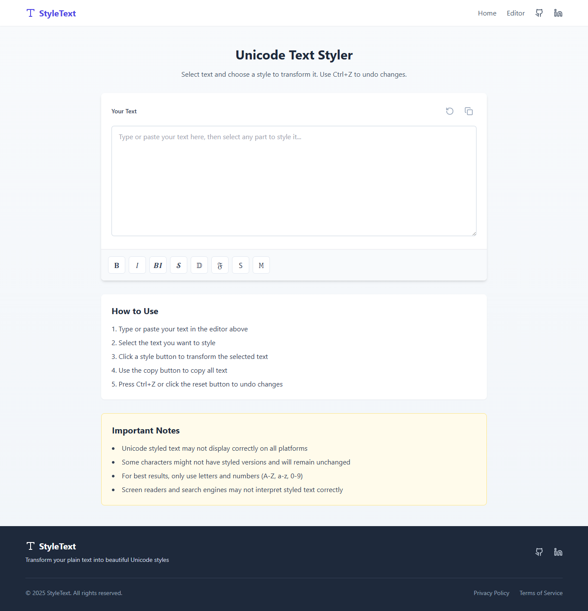

# Linkedin -- problem -- solution (In it also Have problem) -- developer solve that by own

## Main Problem Statement:
LinkedIn's native post editor does not support basic text formatting options such as bold, italic, or stylistic fonts. As a result, users are unable to visually emphasize important parts of their posts, announcements, or profiles—limiting expressiveness and engagement. This lack of formatting capabilities creates a barrier for professionals who want their content to stand out or convey hierarchy in their messaging. ( Marked area represents that You can Set that Thing to there )

## What I Did
I redesigned a web tool that allows users to format LinkedIn text with styles like **bold**, *italic*, and more using Unicode characters.

The original inspiration came from a website called **Style Text**, which offered free resources for LinkedIn formatting—but had a poor user experience. I took the core idea and rebuilt it with a focus on simplicity and usability.

---

## Problems with the Original Site ( its solution also have problem )
- ❌ Confusing UI
- ❌ Difficult to navigate
- ❌ Complicated text selection and copying
- ❌ Poor overall usability for a simple task
- Here is the original UI
- 

---

## What I Improved
- ✅ Clean and user-friendly interface
- ✅ Added a **"Get Started"** button to guide users
- ✅ **Selective text styling** – instead of converting the whole input to one style, users can now apply bold, italic, or other styles **to specific words or parts of the text**
- ✅ Simplified text copying process
- ✅ Ensured styled text appears exactly the same on LinkedIn
- ✅ Improved overall performance and functionality
- Here is my sketch
- 
- & here is my Original UI
- 
- 

---

## Main Goal / Purpose
Originally, I built this for myself to solve a real frustration when formatting LinkedIn posts.

Eventually, I decided to **broaden the purpose** by:
- Enhancing the free resources available on similar sites
- Making the platform more accessible to others
- Creating a tool that’s easier to use for everyone

---

---

## Live Demo / Preview
[Visit the live tool here]*(https://textformatter-freeresourcepagebykavya.netlify.app/)*

---

## Feedback
Open to feedback and suggestions!  
(www.linkedin.com/in/trivedikavya).

---

## 📌 Tags
`#UIRedesign` `#LinkedInTool` `#FrontendProject` `#UXDesign` `#ProblemSolving` `#SideProject`

